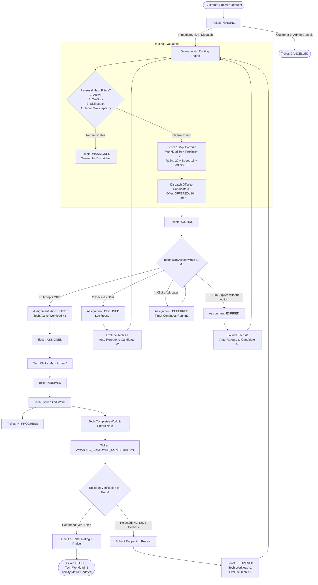
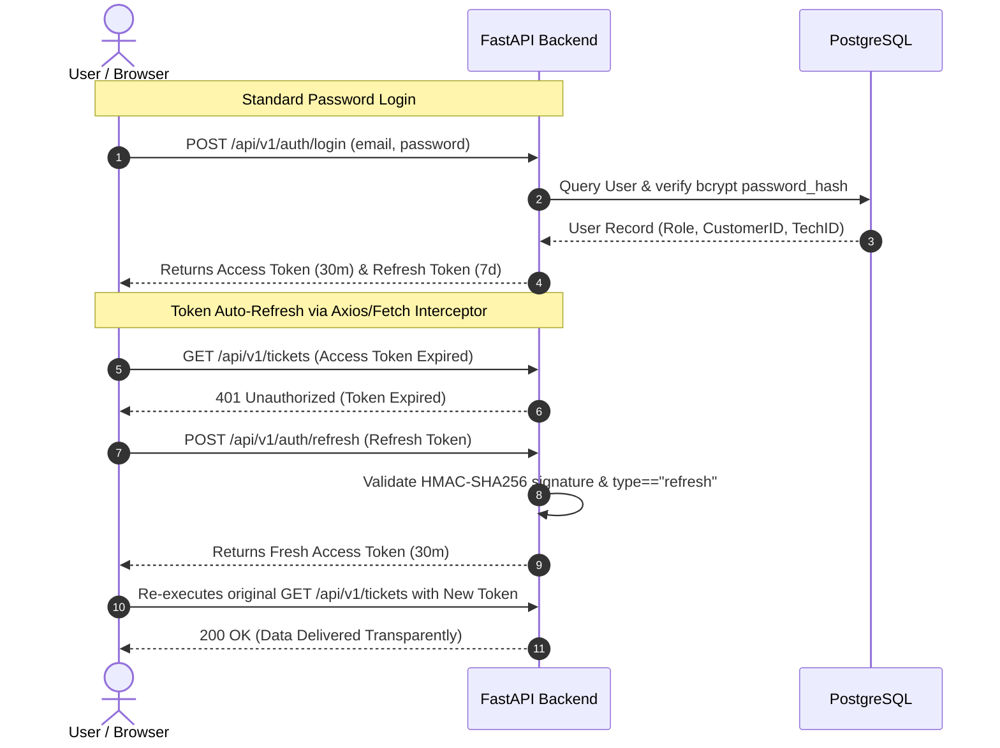

# 🏗️ Smart-HelpDesk — Complete Architecture & Operational Workflows

> **Document Purpose:** Comprehensive technical blueprint containing detailed workflow state charts, lifecycle diagrams, and all possible operational cases (Happy Path, Fallbacks, Timeouts, Reopenings, Edge Cases, and Auth Interceptions).

---

## 📑 Table of Contents
1. [High-Level System Architecture](#1-high-level-system-architecture)
2. [Master Operational Workflow (All Branches & Cases)](#2-master-operational-workflow-all-branches--cases)
3. [Case-by-Case Deep-Dive Scenarios](#3-case-by-case-deep-dive-scenarios)
   - [Case 1: The Standard Happy Path](#case-1-the-standard-happy-path)
   - [Case 2: Specialist Declines Offer (Instant Fallback)](#case-2-specialist-declines-offer-instant-fallback)
   - [Case 3: 10-Minute Timeout / Unresponsive (Expired Sweep)](#case-3-10-minute-timeout--unresponsive-expired-sweep)
   - [Case 4: Specialist Requests "Ask Later" (Deferred State)](#case-4-specialist-requests-ask-later-deferred-state)
   - [Case 5: Resident Rejects Resolution (Negative Verification & Auto-Reroute)](#case-5-resident-rejects-resolution-negative-verification--auto-reroute)
   - [Case 6: Zero Eligible Specialists Available (`UNASSIGNED` Queue)](#case-6-zero-eligible-specialists-available-unassigned-queue)
   - [Case 7: Resident/Admin Cancellation](#case-7-residentadmin-cancellation)
   - [Case 8: Scheduled Maintenance Service](#case-8-scheduled-maintenance-service)
4. [Dual-Token JWT & OAuth2 Authentication Flow](#4-dual-token-jwt--oauth2-authentication-flow)
5. [Deterministic 100-Point Scoring & Tie-Breaking Engine](#5-deterministic-100-point-scoring--tie-breaking-engine)
6. [State Machine Invariant Matrix](#6-state-machine-invariant-matrix)

---

## 1. High-Level System Architecture

```text
 ┌────────────────────────────────────────────────────────────────────────────────────────┐
 │                                   CLIENT LAYER (Browser)                               │
 │                                                                                        │
 │   ┌──────────────────────┐  ┌──────────────────────┐  ┌─────────────────────────────┐  │
 │   │   Resident Portal    │  │  Technician Portal   │  │   Operations Dashboard      │  │
 │   │  • Request Service   │  │  • 10m Offer Card    │  │  • Real-time Queue Monitor  │  │
 │   │  • 6-Stage Stepper   │  │  • Shift Toggle      │  │  • Specialist Capacity Bar  │  │
 │   │  • Resolution Gate   │  │  • Milestone Actions │  │  • Routing Score Inspector  │  │
 │   └──────────┬───────────┘  └──────────┬───────────┘  └──────────────┬──────────────┘  │
 │              │                         │                             │                 │
 │              └─────────────────────────┼─────────────────────────────┘                 │
 │                                        ▼                                               │
 │                           Central Axios/Fetch Interceptor                              │
 │                   (Auto-injects Bearer JWT & Auto-refreshes on 401)                    │
 └────────────────────────────────────────┬───────────────────────────────────────────────┘
                                          │ REST HTTPS / JSON (/api/v1)
                                          ▼
 ┌────────────────────────────────────────────────────────────────────────────────────────┐
 │                                  BACKEND API (FastAPI)                                 │
 │                                                                                        │
 │   ┌────────────────────────────────────────────────────────────────────────────────┐   │
 │   │ Router Layer: `/auth`, `/tickets`, `/assignments`, `/technicians`, `/routing`  │   │
 │   └──────────────────────────────────────┬─────────────────────────────────────────┘   │
 │                                          ▼                                             │
 │   ┌────────────────────────────────────────────────────────────────────────────────┐   │
 │   │ Service Layer:                                                                 │   │
 │   │ • routing_service.py: 4 Hard Filters + 5-Factor 100-Point Scoring Algorithm   │   │
 │   │ • assignment_service.py: Offer Dispatches, Fallback Cascades, Expired Sweeps   │   │
 │   │ • execution_service.py: Atomic Milestone Transitions (Arrive/Start/Complete)  │   │
 │   │ • resolution_service.py: Customer Confirmation Gate, Rating & Affinity Sync    │   │
 │   └──────────────────────────────────────┬─────────────────────────────────────────┘   │
 └──────────────────────────────────────────┼─────────────────────────────────────────────┘
                                            │ SQLAlchemy 2.0 ORM (ACID Transactions)
                                            ▼
 ┌────────────────────────────────────────────────────────────────────────────────────────┐
 │                                DATABASE LAYER (PostgreSQL)                             │
 │                                                                                        │
 │   • users (RBAC credentials, OAuth IDs)                                               │
 │   • tickets (status state machine, location, category_id, customer_id)                 │
 │   • assignments (assignment_status, offered_at, expires_at, arrived_at, note)         │
 │   • technicians (is_active, is_on_duty, skills, max_jobs, current_jobs)               │
 │   • service_categories (category metadata, active toggles)                            │
 │   • ticket_feedbacks (star rating 1-5, comment, customer_id, technician_id)           │
 └────────────────────────────────────────────────────────────────────────────────────────┘
```

---

## 2. Master Operational Workflow (All Branches & Cases)



---

## 3. Case-by-Case Deep-Dive Scenarios

### Case 1: The Standard Happy Path
1. **Resident Alice** creates a plumbing ticket for Apartment 402 $\rightarrow$ Ticket created in `PENDING`.
2. **Auto-Dispatch triggers**: Routing Engine evaluates on-duty plumbers. **Ravi Kumar** scores highest (94 pts).
3. Offer created in `OFFERED` status with `expires_at = now + 10 minutes`. Ticket moves to `ROUTING`.
4. Ravi sees the **Job Offer Card** with a live countdown on `/technician/jobs` and clicks **Accept**.
5. Ticket transitions to `ASSIGNED`. Ravi's `current_active_tickets` increments by 1.
6. Ravi arrives at Tower A and clicks **Mark Arrived** $\rightarrow$ Ticket transitions to `ARRIVED`.
7. Ravi starts repair and clicks **Start Work** $\rightarrow$ Ticket transitions to `IN_PROGRESS`.
8. Ravi finishes repair, enters completion notes (*"Replaced O-ring and cleared drainage pipe"*), and clicks **Complete Service**.
9. Ticket transitions to `AWAITING_CUSTOMER_CONFIRMATION`.
10. Alice sees the **ServiceResolutionCard** on her ticket page, clicks **"Yes, Issue Resolved"**, provides a **5-star review**, and submits.
11. Ticket transitions to `CLOSED`. Ravi's workload decrements by 1, and his customer affinity with Alice is boosted (+10 pts).

---

### Case 2: Specialist Declines Offer (Instant Fallback)
1. **Routing Engine** sends 10-minute offer to Technician Ravi (#1 Candidate).
2. Ravi is currently handling an emergency and clicks **Decline**, choosing reason `BUSY`.
3. System atomically updates assignment to `DECLINED`.
4. **Fallback Engine triggers immediately**:
   - Dynamically adds Ravi's ID to `excluded_technician_ids`.
   - Re-runs 100-point ranking on the remaining eligible roster.
   - Selects Candidate #2 (e.g., Technician Suresh).
   - Generates a new `OFFERED` assignment with a fresh 10-minute window for Suresh.
5. Ticket remains in `ROUTING` with zero manual dispatcher intervention required.

---

### Case 3: 10-Minute Timeout / Unresponsive (Expired Sweep)
1. Offer is dispatched to Technician Ravi with `expires_at = 12:10:00 UTC`.
2. Ravi does not open or respond to the offer within 10 minutes.
3. At `12:10:01 UTC`, the **Expired Offers Scanner** (or Dispatcher manual sweep) triggers `POST /api/v1/assignments/process-expired`.
4. The database queries all assignments where `status == OFFERED` and `expires_at <= now()`.
5. Ravi's offer is marked `EXPIRED`.
6. Ravi is added to the ticket's exclusion set, and Candidate #2 is automatically dispatched a new offer.

---

### Case 4: Specialist Requests "Ask Later" (Deferred State)
1. Technician Ravi receives an offer, but is currently driving or in an elevator.
2. Ravi clicks **"Ask Me Later"** $\rightarrow$ Assignment status updates to `DEFERRED`.
3. **Key Behavior**: The original 10-minute deadline is **NOT extended**. The timer continues counting down from the original timestamp.
4. The card remains visible in Ravi's portal so he can accept before the deadline. If the deadline expires without acceptance, Case 3 triggers.

---

### Case 5: Resident Rejects Resolution (Negative Verification & Auto-Reroute)
1. Technician Ravi marks the plumbing repair complete. Ticket is in `AWAITING_CUSTOMER_CONFIRMATION`.
2. Resident Alice tests the faucet and discovers water is still leaking.
3. Alice opens her ticket, clicks **"No, Problem Persists"**, types an explanation (*"Water still dripping underneath the cabinet"*), and submits.
4. **Automated Reopening Engine**:
   - Transitions ticket status to `REOPENED`.
   - Records feedback entry with `was_issue_resolved = False`.
   - Decrements Ravi's active workload by 1.
   - Updates Ravi's pairwise customer affinity with Alice to -10 penalty.
   - Automatically excludes Ravi from handling this ticket again.
   - Re-evaluates ranking and dispatches an offer to Candidate #2.

---

### Case 6: Zero Eligible Specialists Available (`UNASSIGNED` Queue)
1. A resident submits a ticket for `Carpentry` at 11:00 PM.
2. Routing Engine runs: All carpentry specialists are `is_on_duty == False` or have reached their max workload capacity (`active == max_jobs`).
3. Routing Engine logs `NO_ELIGIBLE_TECHNICIANS` and sets ticket status to `UNASSIGNED`.
4. Ticket displays prominently in the Dispatcher's **Operations Dashboard Queue** (`/dashboard`) under the `Unassigned / Action Needed` filter for manual triage or priority escalation.

---

### Case 7: Resident / Admin Cancellation
1. While a ticket is in `PENDING` status (before a technician has accepted), the resident or an admin clicks **Cancel Ticket**.
2. Ticket moves to `CANCELLED`.
3. Any pending offered assignments are set to `CANCELLED`.
4. If a ticket is already `IN_PROGRESS` or `AWAITING_CUSTOMER_CONFIRMATION`, cancellation is blocked to prevent orphaned field labor.

---

### Case 8: Scheduled Maintenance Service
1. Resident submits a request for a future date: `is_scheduled = True`, `scheduled_for = 2026-09-30T10:00:00Z`.
2. Ticket is created in `PENDING` status.
3. Immediate auto-dispatch is deferred.
4. Ticket stays safely in the scheduled queue until the scheduled time threshold arrives, preventing technician capacity from being tied up days in advance.

---

## 4. Dual-Token JWT & OAuth2 Authentication Flow



---

## 5. Deterministic 100-Point Scoring & Tie-Breaking Engine

$$\text{Total Score} = S_{\text{workload}} + S_{\text{proximity}} + S_{\text{rating}} + S_{\text{speed}} + S_{\text{affinity}}$$

```text
┌─────────────────────────┬────────┬────────────────────────────────────────────────────────┐
│ Factor                  │ Weight │ Formula & Scoring Rules                                │
├─────────────────────────┼────────┼────────────────────────────────────────────────────────┤
│ 1. Available Workload   │ 30 pts │ 30 * (1 - active_jobs / max_jobs)                      │
│ 2. Proximity to Tower   │ 25 pts │ Exact Zone: 25 pts | Neighbor Zone: 15 pts | Other: 10 │
│ 3. Historical Rating    │ 20 pts │ 20 * (avg_rating / 5.0) [Neutral default: 14 pts]      │
│ 4. Completion Speed     │ 15 pts │ Turnaround vs category benchmark                       │
│ 5. Customer Affinity    │ 10 pts │ Previous 5★: +10 pts | Previous Reopen: -10 pts        │
└─────────────────────────┴────────┴────────────────────────────────────────────────────────┘
```

### Deterministic Tie-Breaking Hierarchy:
If two technicians tie with identical total scores (e.g. 85.0 vs 85.0), the engine breaks ties strictly by:
1. **Higher Customer Affinity** (favors historical trust)
2. **Lower Active Workload Count** (favors less loaded tech)
3. **Higher Average Star Rating** (favors quality)
4. **Lower Database Primary Key ID** (guarantees 100% deterministic reproducibility)

---

## 6. State Machine Invariant Matrix

| Ticket State | Valid Next States | Allowed User Actions |
|---|---|---|
| `PENDING` | `ROUTING`, `CANCELLED` | Dispatch Offer (Staff), Cancel Ticket (Customer/Staff) |
| `ROUTING` | `ASSIGNED`, `UNASSIGNED`, `CANCELLED` | Accept Offer (Tech), Decline/Timeout (Triggers Fallback) |
| `UNASSIGNED` | `ROUTING`, `CANCELLED` | Re-trigger Dispatch when specialists come on duty |
| `ASSIGNED` | `ARRIVED`, `CANCELLED` | Mark Arrived (Tech) |
| `ARRIVED` | `IN_PROGRESS` | Start Working (Tech) |
| `IN_PROGRESS` | `AWAITING_CUSTOMER_CONFIRMATION` | Complete Service & Enter Notes (Tech) |
| `AWAITING_CONFIRM`| `CLOSED`, `REOPENED` | Confirm Fixed (Customer) $\rightarrow$ `CLOSED`<br>Reject Fix (Customer) $\rightarrow$ `REOPENED` |
| `REOPENED` | `ROUTING` | Auto-dispatches to Candidate #2 excluding previous tech |
| `CLOSED` | *Terminal State* | Read-only historical record |
| `CANCELLED` | *Terminal State* | Read-only historical record |
